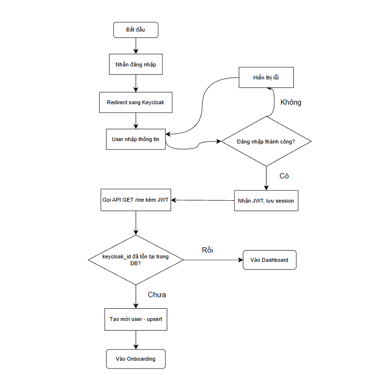
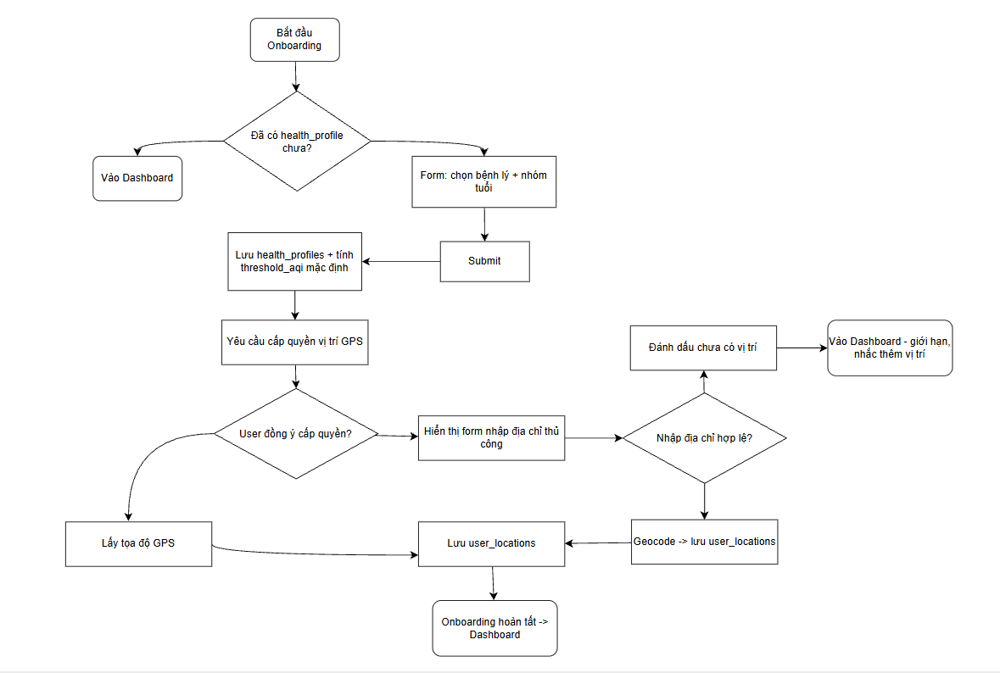
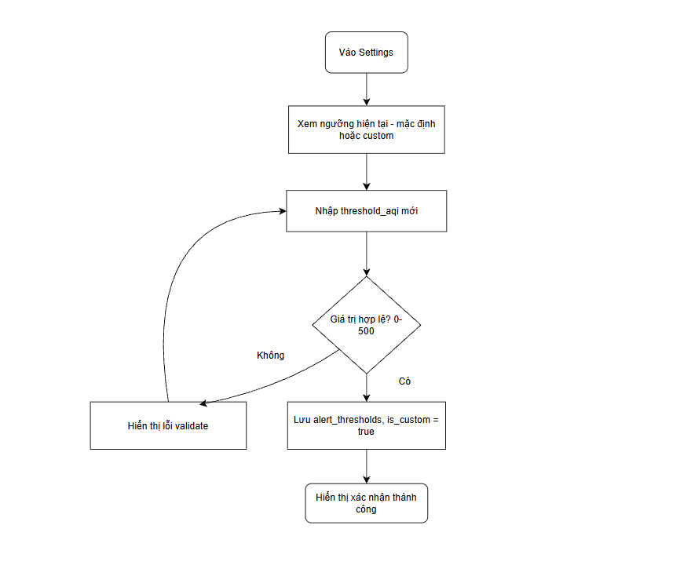
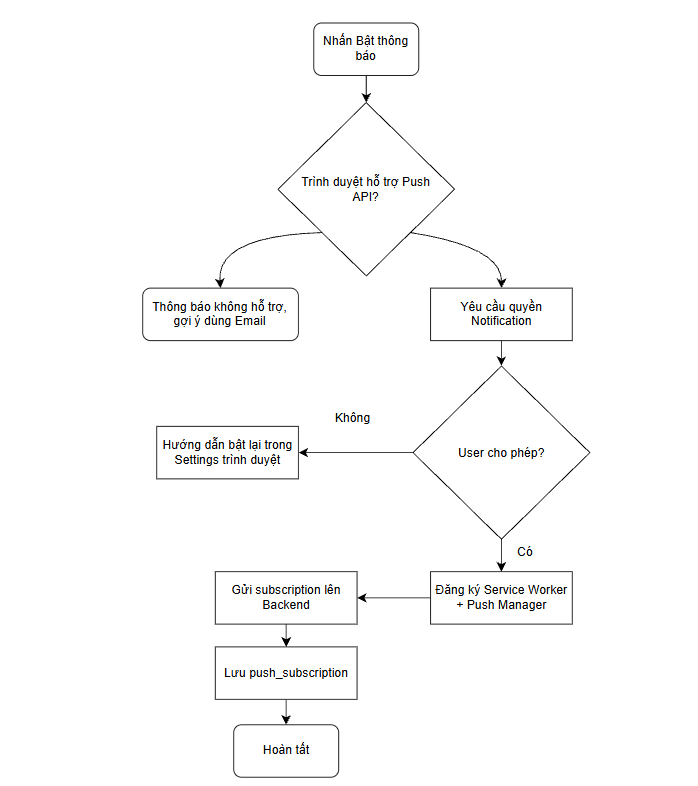
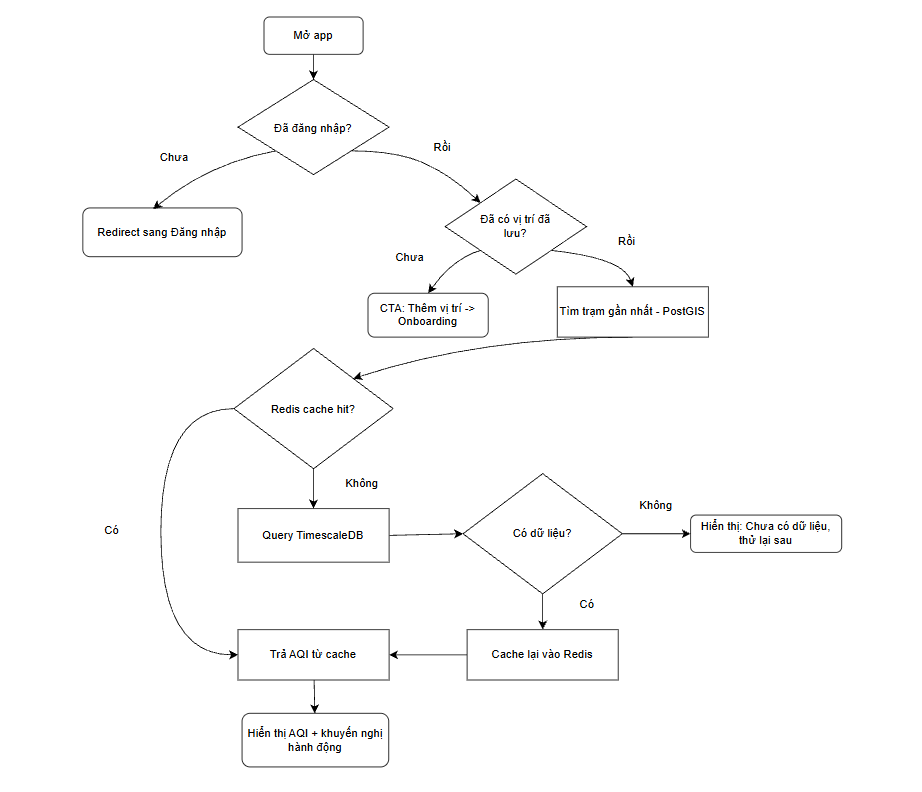
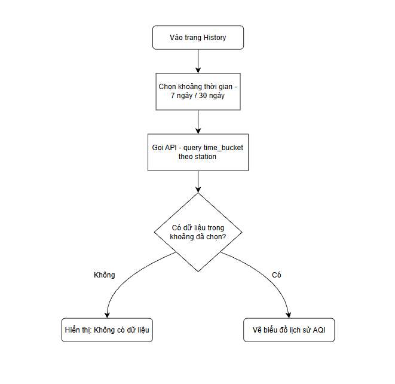
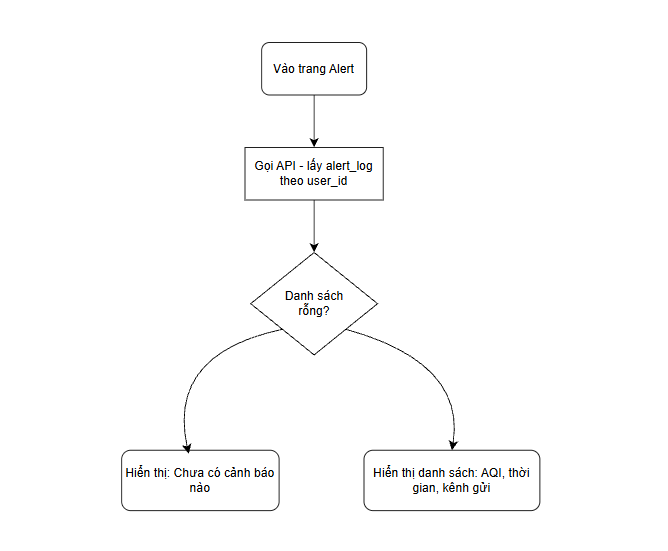

# User Flows — AQI Health Monitor

> Tài liệu này mô tả **7 luồng thao tác chính của người dùng**, ở dạng sơ đồ có nhánh rẽ (không phải văn xuôi tuyến tính) — bổ sung phần còn thiếu ở Bước 2 (User Flow & Wireframe) trong quy trình phát triển.
>
> Khác với `SYSTEM-FLOW.md` (mô tả toàn bộ vòng đời vận hành, gồm cả phần hệ thống tự động), tài liệu này **chỉ tập trung vào các flow do người dùng chủ động khởi xướng**, đi kèm các nhánh rẽ/tình huống ngoại lệ thực tế.
>
> Sơ đồ được vẽ bằng Mermaid, export ảnh đặt tại `../assets/`. Xem file `.mmd`/source đi kèm (nếu có) để chỉnh sửa lại khi flow thay đổi.

## Mục lục

1. [Đăng ký / Đăng nhập](#1-đăng-ký--đăng-nhập)
2. [Onboarding (thiết lập hồ sơ)](#2-onboarding-thiết-lập-hồ-sơ)
3. [Tùy chỉnh ngưỡng cảnh báo](#3-tùy-chỉnh-ngưỡng-cảnh-báo)
4. [Đăng ký nhận Web Push](#4-đăng-ký-nhận-web-push)
5. [Xem Dashboard (AQI hiện tại)](#5-xem-dashboard-aqi-hiện-tại)
6. [Xem History](#6-xem-history)
7. [Xem Alerts (lịch sử cảnh báo)](#7-xem-alerts-lịch-sử-cảnh-báo)

---

## 1. Đăng ký / Đăng nhập

**Mô tả**: từ khi user bấm "Đăng nhập" đến khi có `user_id` nội bộ hợp lệ để gọi các API tiếp theo.

**Nhánh rẽ chính**:

- Đăng nhập Keycloak thất bại → hiển thị lỗi, cho phép thử lại.
- Lần đầu đăng nhập (`keycloak_id` chưa có trong DB) → tự động tạo user (upsert) → chuyển sang Onboarding.
- Đã từng đăng nhập → vào thẳng Dashboard.

---

## 2. Onboarding (thiết lập hồ sơ)

**Mô tả**: thiết lập hồ sơ sức khỏe và vị trí — điều kiện bắt buộc trước khi Dashboard có dữ liệu để hiển thị đầy đủ.

**Nhánh rẽ chính**:

- User đã có `health_profile` từ trước (quay lại app) → bỏ qua, vào thẳng Dashboard.
- User từ chối cấp quyền GPS → chuyển sang nhập địa chỉ thủ công.
- User bỏ qua cả 2 cách nhập vị trí → vào Dashboard ở trạng thái giới hạn, có nhắc bổ sung vị trí sau.

---

## 3. Tùy chỉnh ngưỡng cảnh báo

**Mô tả**: user chỉnh `threshold_aqi` thủ công thay vì dùng mặc định hệ thống tính theo hồ sơ sức khỏe.

**Nhánh rẽ chính**:

- Giá trị nhập không hợp lệ (ngoài khoảng 0–500) → báo lỗi, giữ nguyên giá trị cũ.
- Lưu thành công → đánh dấu `is_custom = true`.

---

## 4. Đăng ký nhận Web Push

**Mô tả**: bật thông báo đẩy trên trình duyệt — tính năng tùy chọn, không bắt buộc để dùng các phần khác của app.

**Nhánh rẽ chính**:

- Trình duyệt không hỗ trợ Push API (VD: Safari cũ) → thông báo không hỗ trợ, gợi ý dùng kênh Email.
- User từ chối quyền Notification → hướng dẫn cách bật lại thủ công trong cài đặt trình duyệt.

---

## 5. Xem Dashboard (AQI hiện tại)

**Mô tả**: màn hình chính — hiển thị AQI hiện tại theo vị trí đã lưu của user.

**Nhánh rẽ chính**:

- Chưa đăng nhập → redirect sang màn hình đăng nhập.
- Chưa có vị trí đã lưu → hiển thị CTA quay lại Onboarding.
- Cache Redis miss và TimescaleDB chưa có dữ liệu (trạm mới/worker chưa chạy lần nào) → hiển thị trạng thái "chưa có dữ liệu".

---

## 6. Xem History

**Mô tả**: xem biểu đồ lịch sử AQI theo khoảng thời gian tùy chọn (7 ngày / 30 ngày).

**Nhánh rẽ chính**:

- Không có dữ liệu trong khoảng thời gian đã chọn → hiển thị trạng thái rỗng, không vẽ biểu đồ trống gây hiểu lầm.

---

## 7. Xem Alerts (lịch sử cảnh báo)

**Mô tả**: xem lại danh sách các lần hệ thống đã gửi cảnh báo cho user.

**Nhánh rẽ chính**:

- Danh sách rỗng (user chưa từng nhận cảnh báo nào) → hiển thị trạng thái rỗng thay vì bảng trống.

---

## Ghi chú

- Khi 1 flow thay đổi do phát sinh nghiệp vụ mới trong lúc code, cập nhật sơ đồ Mermaid gốc trước, export lại ảnh đè vào `../assets/flow-0X.png`, rồi cập nhật phần mô tả nhánh rẽ tương ứng ở trên nếu cần — tránh để ảnh và mô tả bị lệch nhau.
- Các nhánh rẽ liệt kê ở đây (VD: "không cho phép GPS thì chuyển sang nhập tay") là **quyết định nghiệp vụ**, cần đối chiếu và giữ nhất quán với `BUSINESS-RULES.md` khi tài liệu đó được viết.
