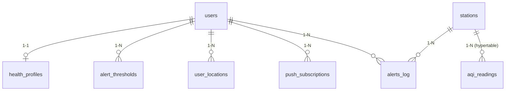

# Database Design Specification (DDS)

**Project:** AQI Health Monitor (Modular Monolith)
**Database Engine:** PostgreSQL 16 + PostGIS + TimescaleDB
**Primary DBMS Port:** 5432 | **Database Name:** `aqi_health_monitor`

> Tài liệu này khớp 1:1 với các file migration đã viết (`backend/migrations/000001` → `000009`). Nếu có thay đổi schema, cập nhật migration trước, sau đó đồng bộ lại tài liệu này.

## 1. Tổng quan Kiến trúc Dữ liệu (Architecture Overview)

- **PostgreSQL 16**: lưu trữ relational data tiêu chuẩn (Users, Subscriptions, Logs).
- **PostGIS Extension** (`GEOGRAPHY(Point, 4326)`): xử lý tọa độ địa lý (GPS lat/lng), tính khoảng cách từ user đến trạm đo gần nhất (`ST_Distance`, `ST_DWithin`).
- **TimescaleDB Extension** (Hypertable): tối ưu lưu trữ và truy vấn time-series cho chỉ số ô nhiễm (`aqi_readings`).

## 2. Sơ đồ Quan hệ Dữ liệu (ERD)



## 3. Chi tiết Bảng & Data Dictionary

### Group 1: Identity & User Profiles

#### 3.1. `users` (đồng bộ từ Keycloak)

*Lưu thông tin cơ bản của người dùng — không lưu password, Keycloak quản lý toàn bộ authentication.*

| Cột | Kiểu dữ liệu | Ràng buộc | Mô tả |
| --- | --- | --- | --- |
| id | UUID | PK, default `gen_random_uuid()` | ID nội bộ hệ thống |
| keycloak_id | VARCHAR(255) | UNIQUE, NOT NULL | Claim `sub` từ Keycloak JWT |
| email | VARCHAR(255) | NOT NULL | Email liên lạc (đồng bộ từ claims) |
| full_name | VARCHAR(255) | NULL | Tên hiển thị |
| created_at | TIMESTAMPTZ | default `now()` | Thời gian tạo |
| updated_at | TIMESTAMPTZ | default `now()` | Thời gian cập nhật |

**Index**: `idx_users_keycloak_id` trên `keycloak_id`.

#### 3.2. `health_profiles`

*Lưu tình trạng sức khỏe cá nhân để tính ngưỡng cảnh báo. Quan hệ 1-1 với `users`.*

| Cột | Kiểu dữ liệu | Ràng buộc | Mô tả |
| --- | --- | --- | --- |
| id | UUID | PK, default `gen_random_uuid()` | ID hồ sơ |
| user_id | UUID | FK → `users(id)` ON DELETE CASCADE, UNIQUE | Tham chiếu user (1-1) |
| condition_type | ENUM `condition_type_enum` | NOT NULL, default `'none'` | `none` \| `asthma` \| `allergic_rhinitis` — đúng phạm vi MVP |
| age_group | ENUM `age_group_enum` | NOT NULL, default `'adult'` | `child` \| `adult` \| `elderly` — dùng áp ngưỡng mặc định |
| sensitivity_level | ENUM `sensitivity_level_enum` | NOT NULL, default `'normal'` | `normal` \| `high` |
| created_at | TIMESTAMPTZ | default `now()` | Thời gian tạo |
| updated_at | TIMESTAMPTZ | default `now()` | Thời gian cập nhật |

#### 3.3. `alert_thresholds`

*Ngưỡng AQI riêng của từng user để kích hoạt cảnh báo.*

| Cột | Kiểu dữ liệu | Ràng buộc | Mô tả |
| --- | --- | --- | --- |
| id | UUID | PK, default `gen_random_uuid()` | ID ngưỡng |
| user_id | UUID | FK → `users(id)` ON DELETE CASCADE | Tham chiếu user |
| threshold_aqi | INT | NOT NULL, CHECK 0–500 | Mức AQI bắt đầu cảnh báo |
| is_custom | BOOLEAN | default `false` | `true` nếu user tự chỉnh, `false` nếu dùng mặc định theo hồ sơ |
| created_at | TIMESTAMPTZ | default `now()` | Thời gian tạo |
| updated_at | TIMESTAMPTZ | default `now()` | Thời gian cập nhật |

**Index**: `idx_alert_thresholds_user_id` trên `user_id`.

### Group 2: GIS & Spatial Data (PostGIS)

#### 3.4. `user_locations`

*Vị trí người dùng quan tâm (GPS hiện tại / nhà) dùng tọa độ PostGIS.*

| Cột | Kiểu dữ liệu | Ràng buộc | Mô tả |
| --- | --- | --- | --- |
| id | UUID | PK, default `gen_random_uuid()` | ID vị trí |
| user_id | UUID | FK → `users(id)` ON DELETE CASCADE | Tham chiếu user |
| label | VARCHAR(50) | NOT NULL, default `'current'` | `current` \| `home` |
| geom | GEOGRAPHY(Point, 4326) | NOT NULL | Tọa độ GPS (WGS84: lng, lat) |
| city | VARCHAR(100) | NULL | `hanoi` \| `ho-chi-minh-city` (khớp scope MVP) |
| created_at | TIMESTAMPTZ | default `now()` | Thời gian tạo |

**Index**: `idx_user_locations_geom` (GiST trên `geom`), `idx_user_locations_user_id`.

#### 3.5. `stations`

*Danh sách trạm quan trắc không khí, đồng bộ định kỳ từ WAQI `/map/bounds/`.*

| Cột | Kiểu dữ liệu | Ràng buộc | Mô tả |
| --- | --- | --- | --- |
| id | UUID | PK, default `gen_random_uuid()` | ID nội bộ — **không dùng ID của WAQI làm khóa chính**, để hệ thống không phụ thuộc cấu trúc ID của 1 nguồn dữ liệu bên thứ ba |
| waqi_station_id | VARCHAR(100) | UNIQUE, NOT NULL | ID trạm gốc từ WAQI (VD: `A3928`) |
| name | VARCHAR(255) | NOT NULL | Tên trạm (VD: "Hoan Kiem, Hanoi") |
| geom | GEOGRAPHY(Point, 4326) | NOT NULL | Tọa độ GPS của trạm |
| city | VARCHAR(100) | NULL | `hanoi` \| `ho-chi-minh-city` |
| is_active | BOOLEAN | NOT NULL, default `true` | Trạm còn hoạt động/trả dữ liệu hợp lệ |
| last_synced_at | TIMESTAMPTZ | NULL | Lần đồng bộ gần nhất — worker dùng để biết trạm cần refresh |

**Index**: `idx_stations_geom` (GiST trên `geom`), `idx_stations_is_active`.

### Group 3: Time-Series Data (TimescaleDB)

#### 3.6. `aqi_readings` *(Hypertable)*

*Toàn bộ chỉ số chất lượng không khí thu thập theo thời gian.*

| Cột | Kiểu dữ liệu | Ràng buộc | Mô tả |
| --- | --- | --- | --- |
| time | TIMESTAMPTZ | NOT NULL, **partition key** | Thời gian đo |
| station_id | UUID | FK → `stations(id)` — **không CASCADE** | Trạm đo. Không xóa dây chuyền dữ liệu lịch sử khi trạm bị xóa/vô hiệu hóa |
| aqi | INT | NOT NULL | Chỉ số AQI tổng hợp |
| pm25 | NUMERIC(6,2) | NULL | Nồng độ PM2.5 (µg/m³) |
| pm10 | NUMERIC(6,2) | NULL | Nồng độ PM10 (µg/m³) |
| o3 | NUMERIC(6,2) | NULL | Nồng độ Ozone (O₃) |
| no2 | NUMERIC(6,2) | NULL | Nồng độ Nitrogen Dioxide (NO₂) |
| so2 | NUMERIC(6,2) | NULL | Nồng độ Sulfur Dioxide (SO₂) |
| co | NUMERIC(6,2) | NULL | Nồng độ Carbon Monoxide (CO) |
| dominant_pollutant | VARCHAR(20) | NULL | Chất ô nhiễm chính (field `dominentpol` của WAQI) |

**Primary key**: `(station_id, time)` — bắt buộc chứa cột partition theo yêu cầu của TimescaleDB.

**Timescale config**:

```sql
SELECT create_hypertable('aqi_readings', 'time');
```

**Index bổ sung**: `(station_id, time DESC)` — tối ưu truy vấn lịch sử theo trạm.

**Compression policy**: nén dữ liệu cũ hơn 30 ngày để tiết kiệm dung lượng — **không tự động xóa dữ liệu thô**, vì lịch sử AQI dài hạn là nguyên liệu cần thiết cho hướng mở rộng Data Analyst/ML (dự báo AQI, phân tích xu hướng theo mùa) đã ghi trong `ARCHITECTURE.md`.

```sql
ALTER TABLE aqi_readings SET (
    timescaledb.compress,
    timescaledb.compress_segmentby = 'station_id'
);
SELECT add_compression_policy('aqi_readings', INTERVAL '30 days');
```

### Group 4: Notifications & System Audit

#### 3.7. `push_subscriptions`

*Web Push Endpoint để gửi notification về trình duyệt.*

| Cột | Kiểu dữ liệu | Ràng buộc | Mô tả |
| --- | --- | --- | --- |
| id | UUID | PK, default `gen_random_uuid()` | ID đăng ký |
| user_id | UUID | FK → `users(id)` ON DELETE CASCADE | Tham chiếu user |
| endpoint | TEXT | NOT NULL, UNIQUE | URL push service của trình duyệt |
| p256dh_key | VARCHAR(255) | NOT NULL | Public key mã hóa |
| auth_key | VARCHAR(255) | NOT NULL | Auth secret |
| created_at | TIMESTAMPTZ | default `now()` | Thời gian tạo |

**Index**: `idx_push_subscriptions_user_id`.

#### 3.8. `alerts_log`

*Lịch sử gửi cảnh báo — dùng cho chống spam (rate-limiting).*

| Cột | Kiểu dữ liệu | Ràng buộc | Mô tả |
| --- | --- | --- | --- |
| id | UUID | PK, default `gen_random_uuid()` | ID nhật ký |
| user_id | UUID | FK → `users(id)` ON DELETE CASCADE | Người nhận |
| station_id | UUID | FK → `stations(id)`, NOT NULL | Trạm kích hoạt cảnh báo |
| aqi_value | INT | NOT NULL | Giá trị AQI tại thời điểm gửi |
| channel | ENUM `alert_channel_enum` | NOT NULL | `web_push` \| `email` |
| sent_at | TIMESTAMPTZ | default `now()` | Thời điểm gửi |
| status | ENUM `alert_status_enum` | NOT NULL, default `'sent'` | `sent` \| `failed` |

**Index**: `idx_alerts_log_user_sent_at` trên `(user_id, sent_at DESC)` — phục vụ trực tiếp câu query "đã gửi cảnh báo cho user này trong X giờ gần đây chưa".

## 4. Chiến lược Tối ưu Performance (Index & Retention)

1. **Spatial Queries (PostGIS)**: dùng `ST_DWithin`/toán tử `<->` kết hợp GiST Index trên `stations.geom` và `user_locations.geom` để tìm trạm gần nhất mà không cần quét toàn bộ bảng.
2. **Time-series Compression (TimescaleDB)**: nén dữ liệu `aqi_readings` cũ hơn 30 ngày — giảm dung lượng đĩa đáng kể mà **vẫn giữ nguyên dữ liệu** để truy vấn lịch sử/phân tích dài hạn (không áp dụng retention policy tự động xóa).
3. **Alert dedup lookup**: index `(user_id, sent_at DESC)` trên `alerts_log` đảm bảo bước kiểm tra chống spam trong luồng Alert Evaluation chạy nhanh (`O(log N)` thay vì quét toàn bảng).

## 5. Ghi chú đối chiếu với migration

Tài liệu này đã đồng bộ hoàn toàn với `backend/migrations/000001` → `000009`. Nếu phát sinh thay đổi schema trong quá trình code (VD: thêm cột mới khi implement Ingestion Worker), cập nhật theo thứ tự: **viết migration mới trước → chạy thử → cập nhật lại tài liệu này sau**, để tài liệu luôn phản ánh đúng trạng thái DB thực tế, không đi trước hoặc lệch pha với code.
