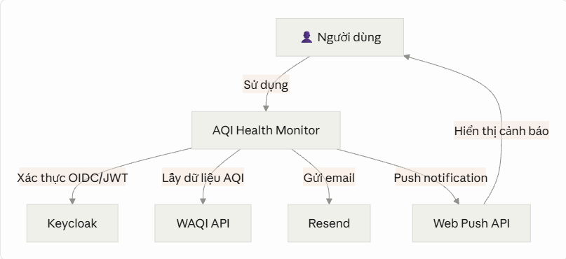

# TÀI LIỆU THIẾT KẾ KIẾN TRÚC HỆ THỐNG

*(System Architecture Document)*
**Dự án: AQI Health Monitor**

Nền tảng theo dõi chất lượng không khí & sức khỏe cá nhân hóa

## 1. Tổng quan & Mục tiêu Hệ thống (System Overview & Context)

### 1.1. Phạm vi dự án (Project Scope)

Kế thừa từ tài liệu Research: hệ thống kết hợp dữ liệu AQI công khai (WAQI) theo vị trí địa lý với hồ sơ sức khỏe cá nhân, để chủ động cảnh báo khi chất lượng không khí vượt ngưỡng an toàn của từng người dùng — thay vì để người dùng tự tra cứu thụ động.

Phạm vi MVP: Hà Nội + TP.HCM, 2 nhóm bệnh lý (hen suyễn, viêm mũi dị ứng), kênh cảnh báo Web Push + Email.

Mục tiêu kỹ thuật trọng tâm: xử lý dữ liệu geospatial (tìm trạm gần nhất), lưu trữ time-series hiệu quả, và vận hành background job đáng tin cậy (fetch định kỳ + đánh giá ngưỡng cảnh báo).

### 1.2. Sơ đồ ngữ cảnh (Context Diagram — C4 Level 1)

Hệ thống tương tác với:

- Người dùng (Actor): đăng ký hồ sơ sức khỏe, xem AQI, nhận cảnh báo.
- Keycloak: hệ thống định danh bên ngoài (self-hosted), chịu trách nhiệm toàn bộ authentication.
- WAQI API (aqicn.org): nguồn dữ liệu AQI công khai bên thứ ba.
- Email Provider (Resend): gửi cảnh báo qua email.
- Trình duyệt người dùng (Web Push): nhận thông báo trực tiếp qua Push API, không qua bên thứ 3 trung gian.

***Hình 1.1: Context Diagram — C4 Level 1***

### 1.3. Yêu cầu phi chức năng (Non-Functional Requirements — NFRs)

*Lưu ý: đây là dự án cá nhân ở giai đoạn MVP/portfolio, không phải hệ thống production thương mại — các chỉ tiêu dưới đây được đặt ở mức hợp lý để chứng minh tư duy thiết kế, không phải cam kết SLA thực tế.*

| Hạng mục | Mục tiêu |
| --- | --- |
| Performance | API response < 300ms cho cache hit; < 1.5s cho cache miss (query TimescaleDB + PostGIS) |
| Scalability | Scale dọc đủ cho MVP; kiến trúc tách cmd/api và cmd/worker cho phép scale ngang độc lập sau này |
| Security | Toàn bộ auth qua Keycloak (OAuth2/OIDC), không tự lưu password; HTTPS bắt buộc ở production |
| Availability & Reliability | Không cam kết SLA số; ưu tiên retry + idempotency cho cron job fetch AQI |

## 2. Kiến trúc Tổng thể (High-Level Architecture)

### 2.1. Phong cách kiến trúc (Architectural Style)

**Modular Monolith**, tách thành 2 tiến trình chạy độc lập từ cùng 1 codebase:

- cmd/api — phục vụ request đồng bộ (REST API cho frontend).
- cmd/worker — xử lý job bất đồng bộ (fetch AQI định kỳ, đánh giá ngưỡng, gửi cảnh báo) qua Asynq.

Lý do lựa chọn: Microservices tách theo domain là over-engineering ở quy mô 1 người phát triển — tăng độ phức tạp vận hành mà không mang lại lợi ích tương xứng. Modular Monolith giữ code trong 1 codebase (dễ refactor, dễ test), nhưng vẫn tách 2 tiến trình theo đặc tính tải khác nhau (request-driven vs time-driven) — đúng với nguyên tắc "đúng và đủ" đã áp dụng khi chọn PostGIS/TimescaleDB thay vì hạ tầng rời.

### 2.2. Sơ đồ kiến trúc tổng quan (High-Level System Architecture — C4 Level 2)

*Client Layer (Web) → API Layer (Go REST) → Service Layer → Data Layer, song song với Event/Queue Layer (Asynq + Redis) → Worker (background jobs).*

- Client Layer: Next.js (App Router) + shadcn/ui.
- API Layer: Go (Gin/Fiber), xác thực JWT qua Keycloak JWKS.
- Service Layer: business logic (health profile, threshold, alert evaluation).
- Event/Messaging Layer: Asynq (dựa trên Redis) — vừa làm task queue, vừa làm cache.
- Data Layer: PostgreSQL + PostGIS + TimescaleDB.

***Hình 2.1: Sơ đồ kiến trúc tổng thể (system_architecture_overview)***

### 2.3. Luồng công nghệ (Technology Stack)

| Layer | Công nghệ |
| --- | --- |
| Frontend | Next.js (App Router) + shadcn/ui + Leaflet/Mapbox + Recharts |
| Backend (API) | Go + Gin/Fiber |
| Backend (Worker) | Go + Asynq |
| Database chính | PostgreSQL + PostGIS (geospatial) + TimescaleDB (time-series) |
| Cache / Message Queue | Redis |
| Authentication | Keycloak (OAuth2/OIDC), NextAuth.js ở frontend |
| External API | WAQI (aqicn.org) — nguồn dữ liệu AQI |
| Email | Resend |
| Containerization | Docker + Docker Compose |
| CI/CD | GitHub Actions |
| Monitoring | Prometheus + Grafana |
| Logging | zerolog/zap (+ Loki tùy chọn) |

## 3. Thiết kế Chi tiết Phân khu & Thành phần (Detailed Component Design — C4 Level 3)

### 3.1. Phân rã Module

| Module | Trách nhiệm |
| --- | --- |
| auth | Verify JWT (JWKS), đồng bộ user (user_sync_service) |
| health_profile | CRUD hồ sơ sức khỏe, tính ngưỡng mặc định theo bệnh lý/nhóm tuổi |
| location | Quản lý user_locations, tìm trạm gần nhất (PostGIS) |
| aqi | Fetch dữ liệu từ WAQI, lưu aqi_readings, phục vụ query lịch sử |
| alert | So khớp aqi_readings mới nhất với alert_thresholds, chống spam qua alerts_log |
| notification | Gửi Web Push (push_subscriptions) và Email (Resend) |

Mỗi module tuân theo tầng: handler → service → repository, đã mô tả chi tiết ở giai đoạn Backend Core.

### 3.2. Thiết kế API & Giao tiếp (Communication Patterns)

#### Internal (trong Modular Monolith)

- API ↔ Service ↔ Repository: gọi hàm trực tiếp (in-process), không qua network.
- API ↔ Worker: bất đồng bộ qua Asynq/Redis (enqueue task) — đảm bảo API không bị block khi có tác vụ nặng.
- Không dùng gRPC/Kafka — quy mô hệ thống chưa cần message broker phức tạp; Redis + Asynq đã đủ.

#### External

- REST API chuẩn, versioning qua path (/api/v1/...).
- Rate limiting: áp dụng ở tầng gọi WAQI API (tôn trọng quota 1.000 req/giây).
- Không dùng API Gateway riêng — có thể bổ sung reverse proxy (Nginx/Caddy) cho TLS termination khi deploy.

### 3.3. Tích hợp dữ liệu (Data Architecture Integration)

Sơ đồ liên kết Database: xem chi tiết đầy đủ 8 bảng (users, health_profiles, alert_thresholds, user_locations, stations, aqi_readings, push_subscriptions, alerts_log) trong tài liệu Data Modeling.

*Hình 3.1. ERD - Sơ đồ quan hệ 8 bảng*

**Chiến lược Caching (Redis):** Cache-aside pattern.

- Đọc: check Redis trước (key theo station_id) → nếu miss, query TimescaleDB → ghi lại vào Redis.
- Ghi: worker ghi aqi_readings vào TimescaleDB trước, sau đó cập nhật/invalidate cache — không dùng write-through vì tần suất ghi thấp.
- TTL cache: ~15–30 phút, ngắn hơn tần suất fetch (1 giờ) để đảm bảo dữ liệu không quá cũ nếu 1 chu kỳ fetch bị lỗi.

**Data Consistency:** Không áp dụng Saga Pattern — vì đây là Modular Monolith với 1 database duy nhất, mọi thao tác ghi trong cùng 1 use case đều dùng transaction ACID chuẩn của PostgreSQL. Saga chỉ cần thiết khi có nhiều service với database riêng biệt (microservices).

## 4. Thiết kế Luồng & Kịch bản Hệ thống (Sequence & Flow Diagrams)

### 4.1. Luồng xác thực & đồng bộ user

JWT do Keycloak phát hành → verify qua JWKS → tìm/tạo user nội bộ theo keycloak_id → gắn user_id vào context xử lý request.

*Hình 4.1. Auth & User Sync Flow*

### 4.2. Luồng nghiệp vụ chính: Ingestion & Alert (background job)

Cron scheduler → fetch WAQI & lưu TimescaleDB → so khớp ngưỡng cảnh báo cá nhân (PostGIS + alert_thresholds) → gửi cảnh báo (Web Push/Email) nếu vượt ngưỡng và chưa gửi gần đây → ghi alerts_log.

*Hình 4.2. AQI Ingestion and Alert Flow*

### 4.3. Luồng xử lý bất đồng bộ khác: Dashboard Viewing (có cache)

Frontend gọi API với vị trí đã lưu → tìm trạm gần nhất (PostGIS) → kiểm tra Redis cache → nếu miss, query TimescaleDB → trả kết quả AQI hiện tại + khuyến nghị hành động.

*Hình 4.3. Dashboard Viewing Flow*

## 5. Bảo mật & Kiểm soát Phân quyền (Security & Access Control Architecture)

### 5.1. Authentication & Authorization

- Authentication: hoàn toàn ủy quyền cho Keycloak (OAuth2/OIDC Authorization Code flow qua NextAuth.js). Backend không lưu password, chỉ verify JWT qua JWKS endpoint.
- JWT Claims sử dụng: sub (map sang keycloak_id nội bộ), email, name, exp/iss.
- Authorization: MVP chỉ có 1 role (user) — mọi user chỉ thao tác trên dữ liệu của chính mình. Có thể mở rộng role admin sau này khi có nhu cầu thực tế.

### 5.2. An toàn dữ liệu

- Encryption in transit: bắt buộc HTTPS (Let's Encrypt) ở production; JWT truyền qua Bearer header.
- Encryption at rest: dựa vào cơ chế mã hóa disk của nhà cung cấp hạ tầng (Railway/Fly.io/VPS).
- Input validation: validator tag ở tầng handler (Go); đặc biệt validate tọa độ GPS hợp lệ trước khi query PostGIS.
- Secrets management: .env cho local, GitHub Secrets cho CI/CD — không hardcode API key.
- Vị trí người dùng là dữ liệu nhạy cảm: chỉ lưu tọa độ cần thiết cho chức năng, không log thô tọa độ ra file log không cần thiết.

## 6. Hạ tầng & Triển khai (Infrastructure & Deployment Architecture)

### 6.1. Sơ đồ hạ tầng (Deployment Diagram)

- Containerization: Docker cho từng service (backend/api, backend/worker, frontend) — dùng chung 1 image Go build multi-stage, khác nhau ở entrypoint.
- Orchestration: Docker Compose (đủ cho quy mô hiện tại — không cần Kubernetes).
- Hạ tầng production: Railway/Fly.io (deploy nhanh từ Git) hoặc VPS tự quản lý (DigitalOcean/Vultr).
- Reverse proxy/TLS: Caddy hoặc Nginx (nếu dùng VPS) — Railway/Fly.io tự xử lý TLS.

*Hình 6.1. Deployment Diagram*

> ⚠️ Lưu ý: mục này trong file gốc chỉ có caption "Hình 6.1", không có ảnh đính kèm thực tế.

### 6.2. CI/CD Pipeline

GitHub Actions, tách 2 workflow theo paths filter:

- backend-ci.yml: lint → unit test → build Go binary → build & push Docker image.
- frontend-ci.yml: lint → build Next.js → build & push Docker image.

Merge vào main (qua PR, theo quy trình Git đã thống nhất) → trigger deploy tự động lên môi trường staging/production.

### 6.3. Giám sát & Nhật ký (Logging, Monitoring & Alerting)

- Metrics: Prometheus scrape từ Go backend — số lần fetch AQI thành công/thất bại, latency API, số alert đã gửi.
- Dashboard: Grafana — trực quan hóa uptime cron job, tỷ lệ lỗi gọi WAQI API.
- Logging: structured logging (zerolog/zap), có thể xuất sang Loki nếu cần; MVP có thể chỉ log ra stdout.
- Tracing: chưa cần OpenTelemetry/Jaeger ở quy mô Modular Monolith hiện tại.
