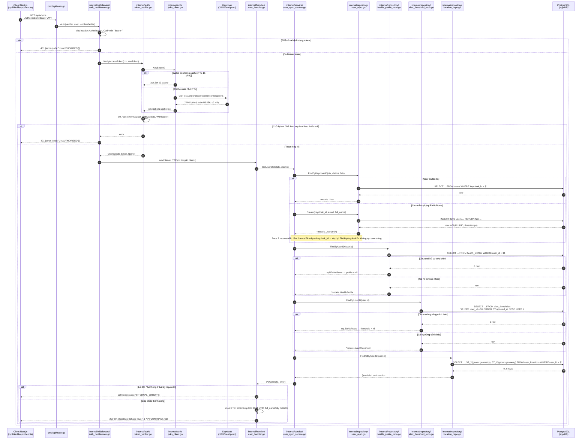

# Sequence Diagram — `GET /api/v1/me`

> Nguồn: implementation Bước 7 — Mục 1 (`task/CURRENT-TASK.md`) và contract `docs/09-API_CONTRACT.md` mục 4.1.
> Mục đích: trực quan hóa luồng xử lý `GET /api/v1/me` xuyên các tầng Client → Middleware → Handler → Service → Repository → Database/Keycloak, kèm tên file thực tế của từng participant.

## 1. Sơ đồ Mermaid

## 2. Participant ↔ file thực tế & trách nhiệm

| Participant | File thực tế | Trách nhiệm |
| --- | --- | --- |
| Client Next.js | `frontend/lib/api/client.ts` (dự kiến; chưa implement ở Bước 7) | Gọi `GET /api/v1/me` kèm `Authorization: Bearer <JWT>` lấy từ NextAuth, nhận `UserState`. |
| `cmd/api/main.go` | `backend/cmd/api/main.go` | Nạp config, mở pool PostgreSQL, dựng `JWKSClient`/`TokenVerifier`/repos/service/handler; đăng ký route `GET /api/v1/me` bọc `middleware.Auth`. |
| `auth_middleware.go` | `backend/internal/middleware/auth_middleware.go` | Trích Bearer token từ header; gọi `VerifyAccessToken`; trả `401 UNAUTHORIZED` nếu thiếu/sai token; gắn `Claims` vào request context rồi chuyển tiếp handler. |
| `token_verifier.go` | `backend/internal/auth/token_verifier.go` | Verify chữ ký JWT qua JWKS, validate `exp`/`iss`, yêu cầu có `sub`; trích `sub`/`email`/`name` thành `Claims`. |
| `jwks_client.go` | `backend/internal/auth/jwks_client.go` | Fetch và cache bộ khóa công khai từ `{issuer}/protocol/openid-connect/certs` (TTL 15 phút), tránh gọi Keycloak mỗi request. |
| Keycloak (JWKS endpoint) | Hệ thống ngoài (chưa có Realm/Client xác nhận) | Phát hành JWT và công bố khóa công khai (JWKS) để backend verify chữ ký. |
| `claims.go` | `backend/internal/auth/claims.go` | Định nghĩa `Claims{Sub, Email, Name}` + helper gắn/đọc claims trong context. |
| `user_handler.go` | `backend/internal/handler/user_handler.go` | `GetMe()` đọc claims từ context, gọi service, map sang DTO đúng shape mục 4.1, ghi JSON; trả `500 INTERNAL_ERROR` khi service lỗi. |
| `user_sync_service.go` | `backend/internal/service/user_sync_service.go` | `FindOrCreate` (upsert theo `keycloak_id`, chống tạo trùng khi race) + `GetUserState` gom aggregate; coi thiếu profile/threshold/location là trạng thái hợp lệ (`nil`/`[]`). |
| `user_repo.go` | `backend/internal/repository/user_repo.go` | `FindByKeycloakID` (trả `sql.ErrNoRows` nếu chưa có) và `Create` (`INSERT ... RETURNING` trả user mới). |
| `health_profile_repo.go` | `backend/internal/repository/health_profile_repo.go` | Bản đọc `FindByUserID` trên bảng `health_profiles` (read-only ở Mục 1). |
| `alert_threshold_repo.go` | `backend/internal/repository/alert_threshold_repo.go` | Bản đọc `FindByUserID` trên bảng `alert_thresholds`, `ORDER BY updated_at DESC LIMIT 1` (read-only ở Mục 1). |
| `location_repo.go` | `backend/internal/repository/location_repo.go` | Bản đọc `FindAllByUserID`; chuyển cột `geom` (PostGIS) sang `latitude`/`longitude` qua `ST_Y(geom::geometry)` / `ST_X(geom::geometry)`. |
| PostgreSQL (app DB) | `backend/migrations/000002–000005` | Bảng `users`, `health_profiles`, `alert_thresholds`, `user_locations` (PostGIS `GEOGRAPHY(Point,4326)`). |

## 3. Nhánh rẽ quan trọng

- **Token:** thiếu/sai định dạng → `401 UNAUTHORIZED` ngay ở middleware (không chạm DB); token sai chữ ký/hết hạn/sai `iss` → `401 UNAUTHORIZED` ở verifier.
- **FindOrCreate:** user đã tồn tại → dùng row cũ; chưa tồn tại → tạo mới. Hai request đồng thời lần đầu gây lỗi unique `keycloak_id` sẽ được xử lý bằng đọc lại thay vì tạo trùng (đúng invariant `BUSINESS-RULES.md` mục 0).
- **Dữ liệu phụ:** thiếu `health_profile` → `health_profile: null`; thiếu `alert_threshold` → `alert_threshold: null`; không có location → `locations: []`. Đây là trạng thái hợp lệ, **không** trả `PROFILE_NOT_FOUND` (theo `docs/09-API_CONTRACT.md` mục 4.1).
- **Lỗi hệ thống:** bất kỳ repo nào lỗi DB → handler trả `500 INTERNAL_ERROR` (mã chung cho 5xx, chưa định nghĩa riêng trong contract).
- **Định dạng:** mọi timestamp trả về ISO 8601 UTC (`RFC3339`, hậu tố `Z`) qua `formatUTC`; `full_name`/`city` nullable.

## 4. Ghi chú

- Bước 7 Mục 1 mới implement backend; participant `Client` là dự kiến (Mục 6 — Frontend nối dây sẽ làm).
- Realm/Client Keycloak thật chưa được xác nhận (rủi ro trong `task/TASKS.md`). Definition of Done của Mục 1 đã được test bằng scratch PostgreSQL 16 + harness OIDC tạm mô phỏng JWKS/token; khi có Keycloak thật chỉ cần trỏ `KEYCLOAK_ISSUER` đúng Realm và đảm bảo client scope trả claim `email`.
